# SOLID
객체 지향 프로그래밍 및 설계의 다섯 가지 기본 원칙.   
유지 보수와 확장이 쉽도록 개발하기 위한 원칙들이다.   

## SRP(Single Responsibility Principle) 단일 책임 원칙
```
하나의 모듈은 하나의, 오직 하나의 엑터에 대해서만 책임져야 한다.
```
<small>액터: 변경을 요청하는 한명 이상의 사람들</small>   
여기서 중요한 부분은 '하나의 엑터에 대해서만 책임진다.'는 부분이다. 다음 예시를 보자

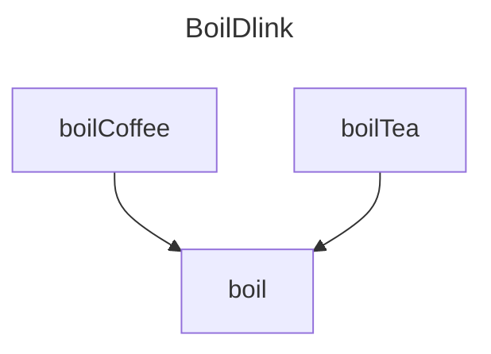

`끓이는 음료인 BoilDlnk에는 차를 끓이는 함수와 커피를 끓이는 함수가 있고 두 함수의 공통된 끓이는 부분을 코드 재사용을 위해 공통 함수로 분리 하였다. 그렇게 개발이 완료되고 먼 훗날,
기존의 가루찻잎대신 티백으로된 찻잎를 사용하게 되면서 차를 끓이는 법을 변경하게 되었다.
새로운 개발자가 업무를 할당 받았고 업무를 할당 받은 개발자는 boilTea가 boil을 호출하고 있다는 사실을 발견 했지만 boilCoffee가 boil을 호출한다는 사실은 발견하지 못했다! 그 상태로 boil을 수정했고 티백으로 차를 끓이는데 문제가 없음을 확인 후 시스템을 배포, 커피를 끓이지 못하게 되었다는 소식을 시스템이 적용된 모든 곳에서 듣게 되었다.`

### 파사드 패턴
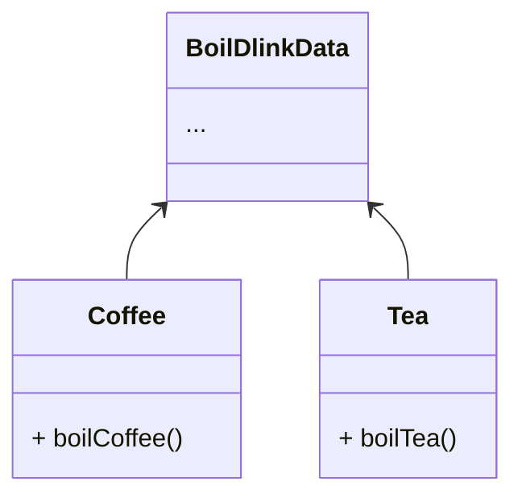
이렇게 수정하면 BoilDlink로 묶어서 처리하던 기능들을 각각 추상화된 Coffee와 Tea로 구현해야 한다.
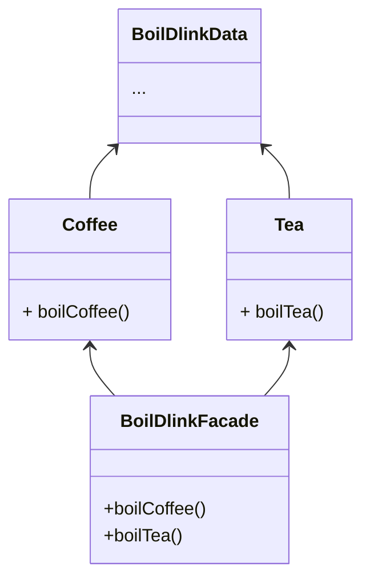
이렇게 하면 BoilDilnkFacade라는 하나의 추상화만 구현하면 된다.   
혹시 BoilDilnk에 종속적인 기능이 있는가? 그렇다면...
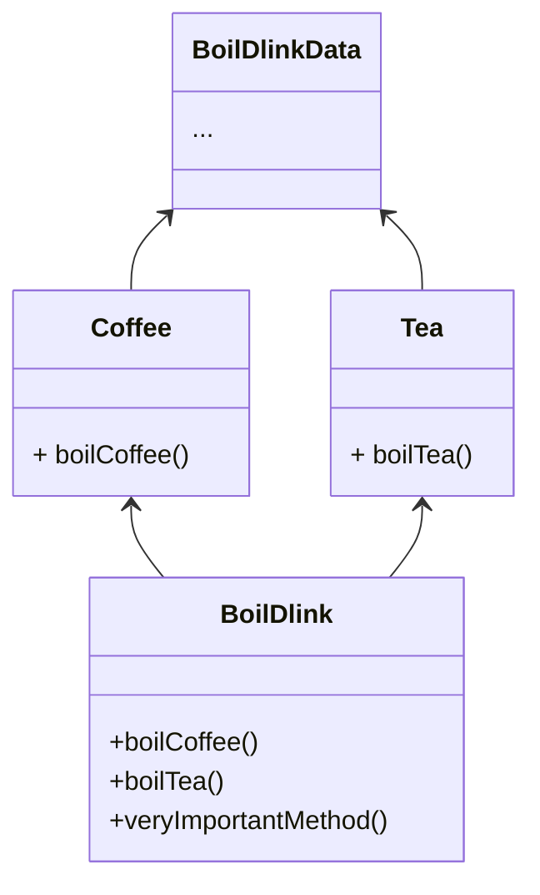
중요 기능은 BoilDlink에 구현하고 다른 메서드를 파사드로 구현하라   

## OCP(Open/closed Principle) 개방-패쇠 원칙

```
소프트웨어 요소는 확장에는 열려 있으나 변경에는 닫혀 있어야 한다.
```
모듈중 하나에 수정을 할경우 그 모듈을 이용하는 다른 모든 모듈또한 수정이 필요 하다면, 이런 프로그램은 수정하기가 어렵다.   
개방-패쇄 원칙은 시스템의 구조를 올바르게 재조직하여 모듈 변경이 더 이상의 수정을 유발하지 않도록 하는 것이다.

 - 확장에 열려 있다.
	어플리케이션의 요구 사항이 변경될 경우, 이러한 변경에 맞춰 새로운 동작을 정의한다.
 - 수정에 대해 닫혀 있다.
	모듈의 소스 코드나 바이너리 코드를 수정하지 않아도 모듈의 기능을 확장하거나 변경할 수 있어야 한다.

사실 위 정의는 해당 원칙이 무엇을 위하는지를 설명하지 어떻게 개발 해야 하는지는 알려주지 않는다.   
MVC패턴의 전체적인 구조를 생각 해보자. Controller의 변경은 Service에서 아무런 영향을 주지 않는다. 마찬가지로 View(Client)의 변경이 Controller의 변경을 요구하지 않는다.   
이렇게 일부 모듈의 변경이 다른 모듈에 영향을 주지 않도록 설계 되어야 한다. 하지만 작은 의문이 하나 생긴다. 그럼 DAO를 변경하면?

### 추이 종속성
아래 예시를 보자.

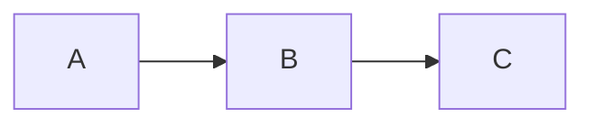

위와 같은 관계에서 A는 C에 대하여 `추이 종속성`을 가진다고 한다. C의 변경에 대해서 A도 위험하다는 뜻이다. 반대로 A가 C와 밀접한 관계를 가진다면 오히려 `추이 종속성`을 제거할 필요가 없다.   

A와 C가 관계가 없다는 전제하에,  아래와 같이 바꾸면 A는 C에 대한 `추이 종속성`을 가지지 않는다.
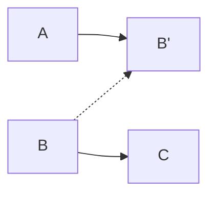
A는 B'을 호출하고 B는 B'을 상속한다. A는 B'에 대한 종속성을 가지지만 B'은 B가 뭘하는지 모르니 A는 B대한 종속성이 없다. 당연히 C에 대한 `추이 종속성`도 없어지게 된다.

## LSP(Liskov Substitution Principle) 리스코프 치환 원칙

```
프로그램의 객체는 프로그램의 정확성을 깨뜨리지 않으면서 하위 타입의 인스턴스를 바꿀 수 있어야 한다.
```
상위타입 T가 하위타입 S에 대하여 프로그램의 속성의 변경 없이 상위 타입 T를 하위 타입 S로 교체 할 수 있어야 한다는 원칙이다.   

매우 당연한 소리다. 상속 관계는 부자관계 처럼 자식의 자유를 보장해서는 안된다. 반드시 가업을 이어야 한다. 그렇지 않으면 부모가 하기로 되어 있던 일은 완전히 망가지게 된다. 매우 유명한 예시를 보자.
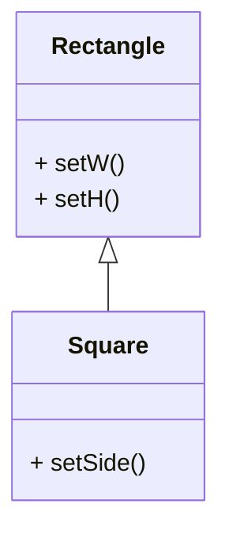
<small>정사각형이 직사각형을 상속받는다.</small>   
이렇게만 본다면 무엇이 문제인가 싶지만 Square가 Rectangle를 대신한다면 문제가 생긴다.
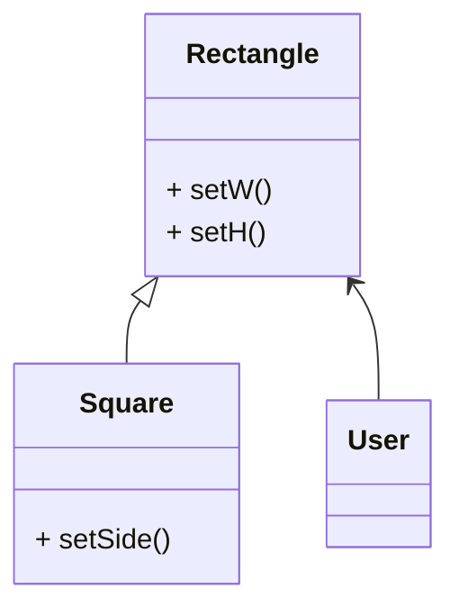
User는 Rectangle가 Rectangle를 상속한 Square인지 구현된 Rectangle인지 알 수 없지만 Square는 가로와 높이를 한번에 변경하기 때문에 실제 Rectangle와는 차이가 발생한다. 

그런데 해당 문제는 아키택트 수준까지 올라올 경우 '현실성' 때문에 어긋나는 경우가 많다. 새로운 예시를 한번 보자   
`당신은 클라이언트의 요구사항에 맞춰 다른 회사와 통신을 하는 서비스를 개발 하였다. 그런데 얼마후 클라이언트가 'enemy.'라는 문자열로 시작하는 요청에 대해서만 또 다른 회사의 기능을 호출하기를 원한다.`   
이런 경우에서 가장 간단한, 또 가장 많이 보게 될 선택은 `if(request.startWith("enemy."))`일 것이다. 뭐 어려운 일이 아니라고 생각 할 수 있을 것이다. 그런데 enemy.뿐만 아니라 trash.으로 시작하는 기능도 enemy.과 같은 회사를 호출해야 하도록 변경해야 한다면? 이제 무엇이 문제인지 알게 되었을 것이다.   
이러한 문제를 해결하기 위해서는 단순히 if문을 사용하는 것이 아니라 별도의 모듈을 통해 격리 되어야 한다.

## ISP(Interface Segregation Principle) 인터페이스 분리 원칙

```
특정 클라이언트를 위한 인터페이스 여러 개가 범용 인터페이스 하나보다 낫다
```
아까 봤던 `추이 종속성`을 보자

말했다 싶이 위 관계에서 C의 변경이 A에게 영향을 줄 수 있다. 그렇지 않아도 C에서 오류가 발생한다면 A까지 같이 고장나게 된다.

## DIP(Dependency Inversion Principle) 의존관계 역전 원칙

```
프로그래머는 추상화에 의존해야지, 구체화에 의존하면 안된다.
```
정확하게는 `변동성`이 없는(혹은 매우 작아서 무시해도 좋을) 것들에 대해서만 의존성을 가지라는 뜻이다. 보통 구체화 클래스는 개발중 얼마든지 변경될 수 있지만 추상화(인터페이스)는 거의 변경되지 않기 때문에 저런 정의를 가지게 되었다.
아래는 코딩중 지켜야할 4가지 법칙이다.

 - 변동성이 큰 구체 클래스를 참조하지 말라
	대신 추상 인터페이스를 사용하라. 올바르게 설계된 아키택처에서는 인터페이스를 변경하는 대신 구체화를 통해 기능을 확장한다.

 	- 변동성이 큰 구체 클래스로 부터 파생하지 말라
		위 법칙에서의 따름정리이지만 상속은 가장 밀접한 관계를 가지고 있다. 항상 신중하자.

 - 구체 함수를 오버라이드 하지 말라
	구체 함수를 오버라이드 하게 되면 그 모든 소스코드 의존성들도 전부 상속 받게 된다.   
	차라리 추상화 함수로 선언하고 각각의 기능에 맞춰 구현하도록하는 것이 좋다.

 - 구체적이며 변동성이 크다면 절대로 그 이름을 언급하지 말라
	DIP가 뜻하는 바가 바로 이것이다.

### 팩토리 패턴
하지만 당연하게도 기능을 사용하기 위해서 당연히 어디선가는 구체적이며 변동성이 큰 기능을 구현을 해야 한다. 이럴때 이 구체적이며 변동성이 큰 인스턴스를 만드는 '팩토리'를 만들어서 해결한다.
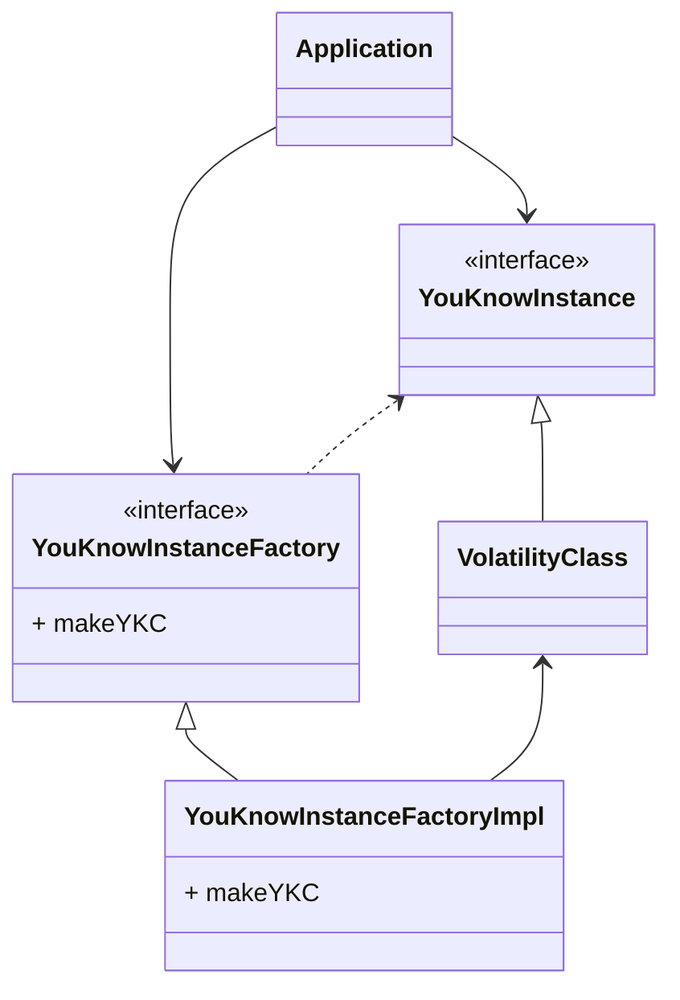
자 해당 예시는 구체적이며 변동성이 큰 VolatilityClass를 Application에서 직접 의존하지 않고 사용하는 방법이다. 클래스 다이어그램으로는 보기 어려우니 플로우차트를 통해 제어 흐름을 보자
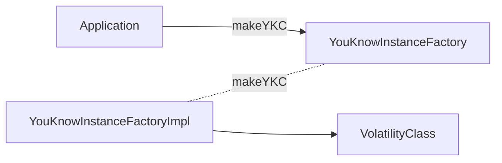
보면 알겠지만 Application은 YouKnowInstanceFactory의 makeYKC를 호출해 VolatilityClass에 대한 `추이 종속성`을 피하고 자료형을 VolatilityClass대신 YouKnowInstance를 호출하여 구체적이며 변동성이 큰 VolatilityClass에 대한 언급을 완전히 피했다. 참고로 '의존관계 역전'이라는 이름이 붙은 이유는 
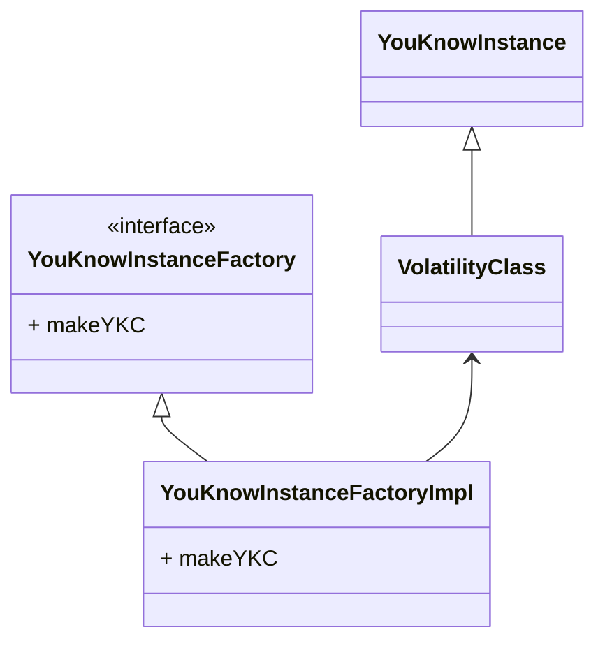
이부분이 코드 의존성을 제어 흐름과 완전히 역전 시켰기 때문이다.   

