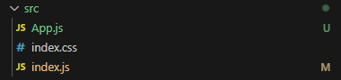
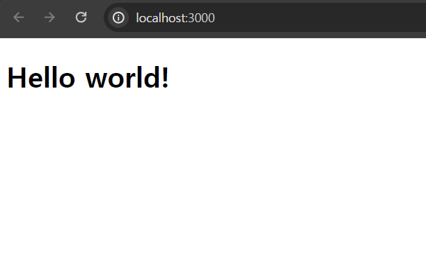
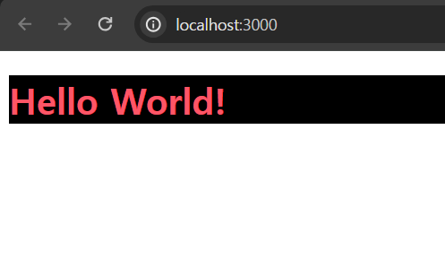

# 탄생배경

## MPA의 한계
MPA는 페이지의 진입시마다 HTML, CSS, js와 같은 리소스를 새로 불러오기 때문에 기본적인 로드 시간만큼 사용자의 대기가 필요했고 페이지 이동시의 화면 깜빡임, 애니메이션의 한계, 서버 의존적 구조등의 사용자 경험 및 개발 가능성에 대한 한계가 존재했고 이러한 문제를 타파하기 위해 SPA가 등장한다, 이게 정설이긴 하지만 중간에 하나의 단계가 더 있습니다.

## Ajax와 Jquery
바로 Ajax를 통한 컨텐츠 새로 고침입니다.   
전체 페이지를 새로 불러오는 대신 게시판의 목록과 같은 동일한 페이지의 핵심 요소의 정보를 서버에서 불러와 Jquery(당시 Jquery는 신그 잡채였습니다.)를 통해 화면에 렌더링 하였습니다.   
저는 이정도로 충분하다고 생각 했는데 Google은 아니었는지 SPA가 등장합니다.

## SPA와 AngularJs
### SPA란?
SPA는 <b>S</b>ingle <b>P</b>age <b>A</b>pplication의 약자로 기존 MPA(Multiple Page Application)와는 다르게 사이트의 최초 진입시 모든 HTML, CSS, js를 로드 하고 이후 js를 통해 DOM을 조작 하며 단 하나의 페이지로 사이트를 구축 하는 방법을 뜻한다.
<details class="info" open>
<summary class="small">장점</summary>

 - 페이지 이동시 깜빡임이 없고 각 화면 전환이 부드럽다. 필요에 따라 애니메이션을 추가해 사용자에게 새로운 경험을 선사 할 수 있다.
 - 페이지 전환 속도가 빠르다
 - 사용자 경험을 엄청나게 향상 시킬 수 있다.
	위 예시처럼 페이지 전환시에 애니메이션을 추가 할 수도 있고 Javascript로 모든 화면 처리를 진행하기 때문에 서버 응답을 기다리는 대기시간이 없는 것 처럼 처리하는 것도 가능합니다.
</details>
		
<details class="info" open>
<summary>단점</summary>	

 - __Network waterfall__
	최초 진입시 모든 HTML, CSS, js를 로드하기 때문에 최초 로드 속도가 엄청 느립니다.   
	[관련기사](https://nischithbm.medium.com/web-performance-optimizing-the-network-waterfall-8a65df932df6)
 - 반 [SEO](https://developer.mozilla.org/ko/docs/Glossary/SEO)문제
	아래 이유 때문에 검색엔진이 사이트를 노출하지 않게 됩니다.(정확히는 우선도가 매우 낮아집니다.)

	- Javascript를 통해 렌더링 하기 때문에 javascript의 구동 없이 페이지의 내용을 읽어들여 사용자에게 노출하는 '검색엔진'은 페이지의 정확한 내용을 알 수 없습니다.

	- MetaData의 통일
			Meta Data는 원래 각 페이지별로 필요한 내용이 들어가야 하지만 SPA는 HTML이 단 1개이기 때문에 모든 페이지의 MetaData가 head에 모이게 됩니다.

	- 크롤링 반 친화적
			이게 개인이 크롤링 하는 것에 대한 이야기가 아닙니다!   
			검색엔진이 검색시에 1줄정도 핵심 정보를 보여주는 것도 크롤링을 통해 이루어지고 해당 웹페이지가 어떤 정보를 가지고 있는지도 크롤링을 통해 파악합니다.
  </details>

하지만 이러한 MPA와 SPA에 대한 이야기는 원래 없었습니다.   
SPA가 익숙한 현대인들도 MPA가 딱히 불편하다는 생각이 없는데 SPA가 존재하지도 않았던 시대에는 그냥 당연한 현상이었습니다.(네이버와 크롬도 MPA입니다.)   
그런데 갑자기 Google의 AngularJs가 등장하면 SPA가 웹 개발에 뜨거운 감자로 떠오르게 됩니다.
### AngularJs
Google이 개발한 SPA프레임워크이자 현대 웹 개발의 조상인 AngularJs는 
당시 존재하던 신(Jquery)의 입지를 끌어 내리고 새로운 신이 될 뻔 합니다.
하지만 여러 이유로 새로운 신이 되지는 못하고 Jquery와 양대 산맥을 이루게 됩니다.
<details class="info hide">
	<summary>AngularJs가 신이 되지 못한 이유 3가지</summary>

1. 길고긴 학습기간
		Jquery가 신이 되었던 가장 큰 이유는 js를 몰라도 3주면 원하는 기능을 구현 할 수 있다는 매우 낮은 학습 난이도 때문이었는데 AngularJs는 js를 이해하고 있는 사람도 2~3달은 걸린다는 매우 높은 학습 난이도 때문에 꺼리는 부분이 있었습니다.   

2. javascript 불친화적 코드 작성 방식
		C++다운 코드가 있고 Java다운 코드가 있듯 javascript다운 코드가 있는데,   
		AngularJs는 다른 형태를 가지고 있는 데다 Jquery와도 어울리지 않았기 때문에 기존 개발자들에게 더 어렵게 느껴졌습니다.   

3. 근본적 한계
		AngularJs는 일정 주기마다 업데이트해야 할 요소를 채크하고 이를 화면에 반영하던 구조적 한계로 인해 어플리케이션의 규모와 사용자의 상호작용 요소가 일정 수를 넘어가면 어플리케이션의 성능이 급속도로 떨어 졌습니다.   
		때문에 이를 해결하기 위한 여러 렌더링 최적화 기법도 따로 공부해야 했죠.
</details>

이러한 문제들로 대체제가 없어서 쓰던 AngularJs에 새로운 대체제가 나타나게 되니 이것이 바로 Facebook에서 출시한 React입니다.

# React
React는 위에서 언급된 3가지 문제를 어느정도 해결하고 현대 웹을 지탱하는 개념인 Virtual Dom와 Component를 도입합니다.
<small>
 - Component 패턴은 원래 있었지만 React의 Component는 좀 달랐습니다.
</small>

1. AngularJs보다는 쉽다
	React도 js를 알고 있다는 가정 하에 1달 정도는 공부 해야하는 학습난이도를 가지고 있습니다. 그런데 비교 대상이 AngularJs가 되니 이게 별 문제가 없어졌습니다.
2. javascript 친화적 코드 작성 방식
	React는 '함수형 프로그래밍'방식과 밀접한 연관이 있는데 이는 순수 javascript의 개발 방식, 방향과도 아주 어울리는 방식이었고 Jquery는 사용할 필요도 없으니 매우 뜨거운 반응을 얻었습니다. (이쯤에 Jquery가 너무 무거우니 다시 바닐라 js로 돌아가자는 움직임이 시작됩니다.)
3. 성능 향상
	AngularJs의 성능적 한계를 Virtual DOM을 통해 극복했습니다. Virtual Dom은 아래에서 설명합니다.

## Virtual Dom
현재는 js로 게임도 만들고 3D그래픽을 렌더링 하기도 하는등 여러 성능에 영향을 주는 요소가 많아졌지만 그럼에도 불구하고 가장 큰 비용을 요구하는 것은 DOM조작인데 React는 Virtual Dom을 통해 DOM조작 비용을 낮췄습니다.

기존 AngularJs는 업데이트할 부분을 일정 주기마다 확인하고 DOM의 조작을 실행하던 반면 React는 Virtual Dom을 통해 즉시 업데이트 내용을 반영하고 Virtual Dom의 업데이트가 종료되는 시점(모든 업데이트 요소가 반영된 시점)에 Virtual Dom의 내용을 실제 Dom에 반영하는 방식을 취하며 사용자 상호작용 요소나 어플리케이션의 규모와는 무관하게 Dom을 조작하며 그 비용을 낮췄습니다.

## Component
컴포넌트는 코드 재사용성을 위해 고안된 것으로 각각의 기능, 사용자 상호작용 요소를 Component로 분리하여 각각 개발하고 이후에 적절한 위치에 컴포넌트를 배치, 조립하여 전체 페이지를 구현하는 방식입니다. 메인보드에 각 부품을 넣어서 PC를 완성하는 것과 같은 느낌이죠
<small>
 - 컴포넌트는 이제 대부분의 프레임워크가 지원하고 있으며 [웹 표준사양](https://developer.mozilla.org/ko/docs/Web/API/Web_components)에도 추가되며 그 유용성이 입증 되었습니다.
</small>

# React 배우기

## step.0 | <span class="row">[프로젝트를 시작하기 전에](https://ko.react.dev/learn/start-a-new-react-project)   </span>
React의 경우에는 프레임워크를 사용하여 개발하는 것이 권장되기 때문에 먼저 프레임워크를 선택해야 합니다.
<details class="info hide">
<summary>
프레임워크 없이 React 사용하기
</summary>

물론 React를 설치하지 않고 [기존 페이지의 일부분에 React를 사용](https://ko.react.dev/learn/add-react-to-an-existing-project#using-react-for-a-part-of-your-existing-page)할 수 있습니다.
다만 프로젝트가 성숙해지며 프레임워크에서 지원하는 기능이 필요해질 확률이 높고, 기능이 추가됨에 따라 JavaScript번들이 커지고 거대해진 코드를 각 경로에 따라 개별적으로 분할해야 할 수 있습니다. 뿐만 아니라 초기 데이터 로드시 필요한 JS의 양이 늘어나며 `Network waterfall`문제가 발생할 수도 있습니다.   
심지어 React의 버전 문제로 고통받을 수도 있습니다.
</details>

하지만 React자체에 집중하기 위해 일단 프레임워크 없이 진행할 예정이지만 원하신다면 프레임워크를 선택하여 시작하실 수 있습니다.   

<details class="info">
<summary>프레임워크 선택하기</summary>

프로덕션 수준의 React 프레임워크
 - [Next.js'Pages Router](https://nextjs.org/)
	풀스택 React 프레임워크, 저희가 사용할 프레임워크입니다.
 	```shell
	npx create-next-app@latest
 	```
 - [Remix](https://remix.run/)
 	중첩 라우팅이 가능한 풀스택 React 프레임워크
	```shell
	npx create-remix
	```
 - [Gatsby](https://www.gatsbyjs.com/)
 	CMS를 활용한 빠른 웹 사이트를 작성하는 React 프레임워크
 	```shell
	npx create-gatsby
 	```
 - [Expo](https://expo.dev/) - 네이티브 앱
	진짜 네이티브 UI를 갖춘 <b>유니버설 안드로이드, iOS, 웹</b>을 작성할 수 있는 React 프레임워크
 	```shell
	npx create-expo-app
 	```
</details> 
이제 시작합니다.


## step.1 | <span class="row">[React 프로젝트 시작하기](https://ko.legacy.reactjs.org/tutorial/tutorial.html)</span>

1. 원하시는 작업 폴더로 이동하여 아래 명령어를 실행해 `my-app` 프로젝트를 생성합니다.
	<small>
	 - my-app 폴더가 생기고 해당 폴더 아래 프로젝트 파일이 추가됩니다.
	</small>
	```shell
	npx create-react-app my-app
	```
2. 프로젝트가 생성되었다면 원하는 에디터에서 프로젝트를 열고 `src`아래 모든 요소를 삭제합니다.
	<small>
 	 - `src`자체는 지우면 안됩니다.
	</small>

3. 이제 `src`에 `index.css`와 `index.js`, `App.js`파일을 추가하고
	
	터미널에서 아래 명령어를 통해 프로젝트를 실행합니다. (App.js는 없어도 무관합니다.)
	```shell
	npm start
	```
	다 되었다면 [http://localhost:3000](http://localhost:3000)에 접속해 아무것도 없는 화면을 확인합니다. 
4. index.js에 아래 내용을 추가하고 (이 이후로 이 파일은 거의 수정하지 않습니다.)
	```jsx
	import ReactDOM from 'react-dom/client';
	import './index.css';
	import App from './App';

	const root = ReactDOM.createRoot(document.getElementById('root'));
	root.render(
		<App></App>
	);
	```
	App.js에도 내용을 추가합니다.
	```jsx
	export default function App() {
		return (
			<h1>Hello world!</h1>
		)
	}
	```
	이제 [http://localhost:3000](http://localhost:3000)을 새로고침하면 <b>Hello world!</b>를 보실 수 있습니다.
	

## step.2 | <span class="row">[UI 표현하기](https://ko.react.dev/learn/describing-the-ui)</span>
React 어플리케이션은 <b>컴포넌트</b>라고 하는 독립된 요소들로 이루어 지며 이 컴포넌트들은 모두 JavaScript 함수 입니다.

컴포넌트는 영문 대문자로 시작하는 이름을 가지며 이를 통해 React가 일반 HTML태그와 React 컴포넌트를 구분할 수 있습니다.
<small>
 - 소문자로 시작하는 요소는 일반 HTML태그로 인식하여 오류를 반환하기 때문에 반드시 대문자로 시작해야 합니다.
</small>

또한 [JSX](https://react.dev/learn/writing-markup-with-jsx)구문을 사용해 JavaScript에서 HTML과 같은 모습으로 편리하게 사용할 수 있습니다.
<small>
 - JSX는 React없이 사용 가능합니다. 반대로 React또한 JSX없이 사용 가능합니다.
</small>

```jsx
export default function MyComponent() {
	return (
		<h1>Hello World!</h1>
	)
}
```

### [다만 JSX도 규칙이 있습니다.](https://ko.react.dev/learn/writing-markup-with-jsx)
1. 하나의 루트 엘리먼트로 반환하기
 한 컴포넌트에서 반환되는 최상위 요소는 반드시 1개여야 합니다.   
 다만 [\<Fragment>(<>)](https://ko.react.dev/reference/react/Fragment)태그를 통해 굳이 HTML요소를 만들지 않아도 됩니다.
<details class="info hide">
<summary>JSX태그를 하나로 감싸줘야 하는 이유</summary>
JSX는 내부적으로 JavaScript객체로 변환되기 때문에 하나의 함수에서는 하나의 객체를 반환해야 한다는 규칙을 준수해야 하기 때문입니다.
</details>

2. 모든 태그를 닫아야 합니다.
 HTML태그와 Component모두 동일하게 태그를 닫아야 합니다.
 [HTML에는 존재하지 않지만, 셀프 클로징 태그(`<tag />`)](https://developer.mozilla.org/ko/docs/Glossary/Void_element#%EC%8A%A4%EC%8A%A4%EB%A1%9C_%EB%8B%AB%EB%8A%94_%ED%83%9C%EA%B7%B8)를 사용할 수도 있습니다.
 ```jsx
 export function Component() {
	return (
		<input />
	)
 }
 ```

3. 대부분 카멜 케이스로
컴포넌트의 어트리뷰트를 변수로 변환합니다. 이때 변수명은 [JavaScript의 변수명 제한](https://developer.mozilla.org/ko/docs/Learn/JavaScript/First_steps/Variables#%EB%B3%80%EC%88%98_%EC%9D%B4%EB%A6%84%EC%97%90_%EB%8C%80%ED%95%9C_%EA%B7%9C%EC%B9%99)을 따르기 때문에 `-`이나 `class`와 같은 에약어를 사용할 수 없습니다.   
class와 같은 일부 변수명 제약에 영향을 받는 어트리뷰트는 [별도의 단어](https://ko.react.dev/reference/react-dom/components/common)를 사용해야 하니 주의하세요.
 	<samll>
	
 	 - 역사적인 이유로 `aria-*`와 `data-*`는 HTML과 동일하게 `-`을 사용하여 작성합니다.
 	</small>

HTML을 JSX로 변환하기 귀찮다면 [변환기](https://transform.tools/html-to-jsx)를 통해 편리하게 변환할 수 있습니다.

### [중괄호로 JSX안에서 JavaScript 사용하기](https://ko.react.dev/learn/javascript-in-jsx-with-curly-braces)
JSX내부에서 `{ }`를 통해 JavaScript를 사용할 수 있습니다.   
```jsx
export function Component {
	const msg = "Hello world!";
	return (
		<h1>Message: {msg}</h1>
	)
}
```
중괄호는 다음과 같은 경우에만 사용할 수 있습니다.
 1. JSX내그 내부의 __문자__
	`<h1>{name} hello!<h1>`는 작동하지만, `<{tag}>Hello</{tag}>`는 작동하지 않습니다.
 2. `=`바로 뒤에 오는 __어트리뷰트__
	`src={source}`는 `source`변수를 참조하지만 src="{source}"는 "{source}"라는 문자열로 로 해석됩니다.

 - __이중 중괄호__
 	JSX에서는 `{ }`안에 바로 `{ }`를 넣을 경우(`{{ }}`) 내부 `{ }`를 객체로 해석합니다.

	<details class="info" open>
	 <summary>App.js</summary>

	 ```jsx
	 //이것은 예시일 뿐입니다.
	 // 인라인 스타일은 최대한 지양 해야합니다.
	 export default function App() {
	 	return (
	 		<h1
	 			style={{
	 				backgroundColor: "black",
	 				color: '#f56',
	 			}}
	 		>
	 			Hello World!
	 		</h1>
	 	)
	 }
	 ```
	</details>


	<small>

	 - 참고로 인라인 style을 사용할 경우 각 속성은 카멜 케이스로 작성해야 합니다. `style={{background-color: black}}`대신 `style={{backgroundColor: black}}`   
	 물론 그냥 사용하지 않는 것이 좋습니다.
	</small>

	

### props
 props는 jsx태그에 전달하는 정보로 어트리뷰트와 동일합니다.   
 다만 이 어트리뷰트를 Component가 받을때 props라는 이름으로 부릅니다.    
 먼저 부모-자식 관계의 컴포넌트를 만들어 줍니다.
 <details class="info" open>
  <summary>App.js</summary>

 ```js
 function Avatar() {
 	return (
 		
 	);
 }
 
 export default function Profile() {
 	return (
 		<Avatar />
 	);
 }
 ```
 </details>

부모 컴포넌트에서 자식 컴포넌트로 정보를 넘겨주도록 코드를 수정합니다.
```jsx
export default function Profile() {
 	return (
 		<Avatar
			person={{name: 'Lin Lanying', imageId: 'ibx5QH6'}}
			size={100}
		/>
 	);
 }
```
그리고 자식 컴포넌트에서 전달받은 props를 사용할 수 있습니다.
```jsx
function Avatar({person, size}) {
	return (
		
	);
}
```
이제 하나의 컴포넌트를 재사용하여 여러 Avatar를 표현 할 수 있습니다.
```jsx
export default function Profile() {
	return (
		<>
			<Avatar
				size={100}
				person={{
					name: 'Katsuko Saruhashi',
					imageId: 'YfeOqp2'
				}}
			/>
			<Avatar
				size={80}
				person={{
					name: 'Aklilu Lemma',
					imageId: 'OKS67lh'
				}}
			/>
			<Avatar
				size={50}
				person={{
					name: 'Lin Lanying',
					imageId: '1bX5QH6'
				}}
			/>
		</>
	);
}
```

구조 분해 문법을 통해 props를 단순하게 전달 할 수도 있습니다.
```jsx
export function Profile() {
	const prop = {
		size: 50,
		person: {
			name: 'Lin Lanying',
			imageId: '1bX5QH6'
		}
	}
	return (
		<Avatar
			{...prop}
		/>
	)
}
```

