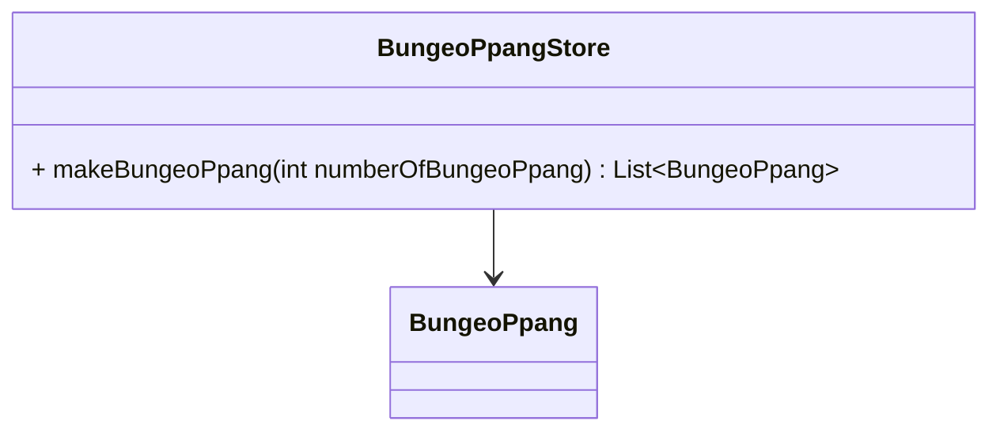
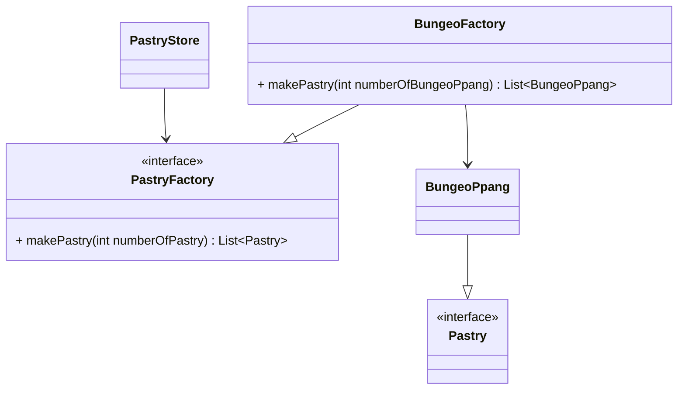
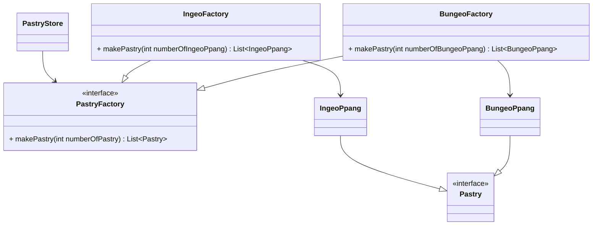
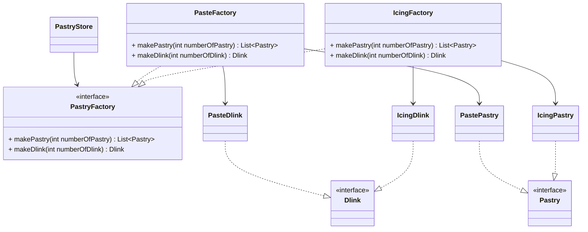
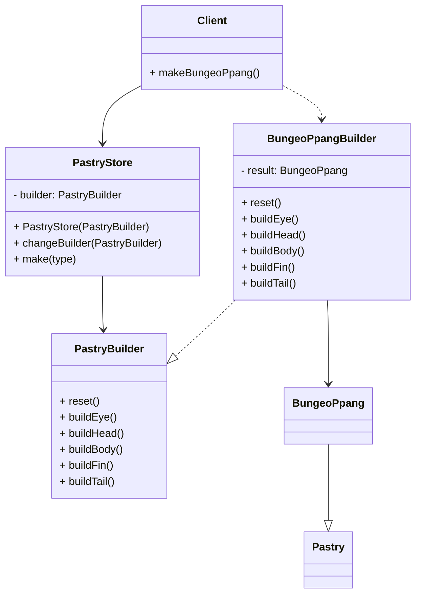

# 디자인 패턴
수학에서의 여러 법칙들이 있듯, 프로그래밍에서는 패턴이 있다.   
복잡한 문제들을 쉽게 해결 할 수 있는 여러 패턴을 소개한다.   
모든 패턴은 아래의 붕어빵 상점을 기초로 설명 한다.

해당 문서의 내용은 다음 사이트의 내용을 기초로 했다. [REFACTORING-GURU](https://refactoring.guru/ko/design-patterns)
## 생성 패턴
기존 코드의 유연성과 재사용성을 증가시키기 위해 고안된 객체 생성 방법들

### 팩토리 (Factory)
자 어느날 우리의 놀라운 붕어빵 가게의 매출을 보고 감동을 받은 사장이 사업을 확장해 '잉어빵' 가게를 만들고 싶다고 한다. 이 앱을 어떻게 바꿔야 할까?   

 - 새로운 잉어빵 가게 앱을 만들어야 하니 비용을 지불하라고 한다.   
 - BungeoPpang을 fishShapedPastry으로 바꾸고 fish속성을 추가한다.   
 - 새로운 IngeoPpangStore을 추가한다. 물론 IngeoPpang의 추가도 잊지 않는다.   
 - 잉어빵 따위 지난 시대의 패배자일 뿐이라고 주장한다.   

뭐 여러 방법이 있겠지만 잉어빵 뿐만 아니라 국화빵이나 기타 다른 것들을 또 추가할 때마다 어플리케이션 전체를 뜯어 고쳐야 한다는 매우 큰 문제가 있다. 이러한 문제를 해결하기 위한 방법으로 '팩토리 패턴'을 사용한다.   
팩토리 패턴은 객체를 생성할때 필요한 곳에서 생성하는 것이 아닌 팩토리 메서드를 호출해 간접적으로 생성하는 방법이다.   
이렇게만 본다면 그냥 생성자의 위치를 옮겼을 뿐이라고 생각 할 수 있는데 
이는 추상화와 결합해 큰 힘을 발휘 할 수 있다. 아래 예시를 보자

엄청 복잡해 졌다고 생각할 수 있지만 수만 많고 딱히 복잡하지는 않다.   
하지만 잉어빵 가게를 추가하기 위해 들어가는 수고는 매우 적어졌다.  
잉어빵 클래스와 잉어빵 팩토리를 추가하고 새로운 PastryStore를 만들기만 하면 된다!

그렇다면 처음부터 Store, Factory, Product를 사용해서 빵이던 자동차건, 옷이건 아무거나 팔 수 있게 만들면 되는거 아닌가?   
그래도 상관은 없지만 굳이 그정도로 추상화 하는 것은 좋지 않다. 왜냐하면 Store와 같이 너무 큰 개념으로 추상화를 하게 되면 해당 클래스가 정확히 어떤 일을 하는지 유추하기가 힘들어져 코드의 명확성이 떨어지기 때문이다. 더 깊은 추상화로 해결할 수는 있지만 그렇게 된다면 실제 코드에 비해 추상화 단계가 너무 깊어져 코드가 복잡해진다.      
지금 처럼 붕어빵이나 잉어빵 가게 정도만 있는데 Store로 묶는다면 마치 다른 자동차 가게나 옷 가게가 있는 것 처럼 느껴져 다름 사람이 볼때 코드를 파악하기 힘들다. 그렇기 때문에 너무 큰 개념으로 묶는 것은 좋지 않다.   
물론 진짜 자동차 가게도 있고 옷 가게도 있고 한다면 Store와 같은 넓은 개념으로 묶어야 한다. 중요한 것은 규모에 맞는 설계가 필요하다는 것이다.   

### 추상 팩토리 (Abstract factory)
자 이번에 우리 회사에서 신제품 로제제로로바마라아이싱 잉어빵의 출시와 함께 여러 빵들과 같은 맛의 음료로 구성된 세트 메뉴도 같이 출시하게 되었다. 뿐만 아니라 모든 빵들은 모두 동일한 맛이 출시 된다. 이번에는 어떻게 해야 할까?

 - Dlink클래스의 추가와 함께 BungeoPpang클래스에 flavor속성을 추가하고 factory에 makeSetMenu메소드를 추가한다.   
 - 그런 끔찍한 것은 세상에 존재해서는 안되며 아무리 비인륜적인 무기라도 그 잉어빵 보다는  인도적일 것이라고 주장한다.   

위 방법에는 큰 문제가 하나 있다, 바로 로제제로로바마라아이싱이 문제다. 맛이 있는가 없는가가 문제가 아니라 아이싱을 기존 붕어빵에 팥을 넣는 것 처럼 넣었다간 아이싱이 녹아 속이 없는 공갈빵이 된다는 것이다! 그래서 아이싱을 사용하여 만드는 방법과 팥을 넣어 만드는 방법은 분리가 되어야 하는데 이런 상황을 위한 것 같은 패턴이 바로 추상 팩토리 패턴이다. 백문불허일견 아래 예시를 보자


### 빌더 (Builder)
기존에 없던 새로운 맛으로 세상을 놀라게한 우리의 사장이 또 새로운 제품에 대한 아이디어를 주고 갔다. 이번에는 어떤 문제가 우리를 반겨줄지 한번 보도록 하자.
```
요즘 MZ세대는 새로운거, 특별한 거 뭐 그런거 찾잖아 그런데 우리 붕어빵은 그냥 평범 하잖아
옛날부터 있던 그냥 익숙한 거니까. 그래서 내가 생각을 해봤는데 그 MZ들이 남들과 차별화 하고 싶고 그러니까
고객이 특별하게 만들 수 있는 붕어빵을 만드는거 어떨까?
그냥 반죽이랑 속같은거 몇개만 바꾸면 재미 없으니까
눈,몸통,지느러미1,지느러미2,내장1,내장2,내장3뭐 이렇게 부속별로 해서 만들 수 있게 하면 좋을 것 같은데?
그 서뭐시기하는 샌드위치가게 처럼 원하는 붕어빵을 만들 수 있게 해주는 거지
```
자 이걸 어떻게 해야 할까?
 - 붕어빵의 생성자에 각 부속 생성에 필요한 옵션을 전부 전달해 붕어빵을 생성한다.
 - 붕어빵의 생성자에 각 부속을 받아 붕어빵은 받은 부속들을 조립하는 역할만 한다.
 - 사악한 부르주아가 노동자를 착취하려고 한다며 혁명을 통해 문제를 해결하자고 주장한다.
 
붕어빵대신 붕어빵 생성자를 만들어서 해결한다.   
붕어빵 생성자는 각 부위(뭐 눈, 몸통, 지느러미1...)를 만드는 함수로 이루어져 있고 getBungeoPpang()함수를 통해 생성이 완료된 붕어빵을 받을 수 있는 패턴이다. (물론 각 부위를 생성 할 때마다 해당 부위가 장착된 붕어빵을 반환해서 활용할 수도 있다.)


### 프로토타입 (Prototype)
자 합체 붕어빵을 구현하며 사소한 문제가 하나 생겼는데, 동일한 붕어빵을 양산하기가 힘들어졌다. 붕어빵 생성자를 몇개를 만드는지! 그래서 기존 붕어빵 생성자의 정보를 복제해 활용하기로 하였다.   
이제 모든 붕어빵은 clone함수를 구현하고 붕어 빵의 각 부속들도 clone함수를 구현한다.   
clone은 자신과 동일한 인스턴스를 만들고 해당 인스턴스에 자신의 값들을 채워 넣어 자신과 동일한 정보를 가지는 새로운 인스턴스를 만들어 반환한다.   

### 싱글턴(톤) (Singleton)
객체를 생성할때 단 하나의 객체만을 생성해 해당 객체를 돌려쓰는 방식으로 해당 유형의 객체는 오직 단 하나만 존재할 수 있다. 이점에서 메모리상 이점을 얻는데 꽤 많은 단점이 있으니 꼭 확인 해보자.

## 구조 패턴
객체와 클래스의 구조를 유연하고 효율적이게 유지하며 더 큰 구조로 조립하는 방법을 제공합니다.   

### 어댑터 (Adapter), 래퍼(Wrapper)

### 브리지 (Bridge)

### 복합체 (Composite)

### 데코레이터 (Decorator), 래퍼 (Wrapper)

### 플라이웨이트 (Flyweight), 캐시

### 프록시 (Proxy)

## 행동 패턴
알고리즘 및 객체 간의 책임 할당과 관련되어 있습니다. 


### 책임 연쇄 패턴 (Chain of Responsibility), CoR, 커맨드 체인 (Command Chain)

### 커맨드 패턴 (Command), 액션, 트랜잭션

### 반복자 패턴 (Iterator)

### 중재자 패턴 (Mediator), 중개인, 컨트롤러

### 메멘토 (Memento), 스냅샷

### 옵저버 (Observer)

### 상태 (State)

### 전략 (Strategy)

### 템플릿 메서드 (Template Method)

### 방문자 (visitor)