# 컴포넌트 응집도
어느 클래스가 어느 컴포넌트에 포함되어야 하는가? 놀랍도록 중요하지만 놀랍도록 적당히 정해지는 문제다. 이러한 문제를 올바르게 해결하기 위한 세가지 법칙에 대하 알아보자.

## 컴포넌트 응집도에 대한 세가지 원칙

### REP 재사용/릴리스 등가 원칙
```
하나의 컴포넌트로 묶인 클래스와 모듈은 반드시 함께 릴리즈 될 수 있어야 한다.
```
별로 설명할 부분이 없다. 그냥 그정도로 높은 응집도를 가지는 것들을 한대 묶어야 한다는 뜻이다.  

### CCP 공통 패쇄 원칙
```
동일한 문제로 동일한 시점에 변경되는 클래스를 같은 컴포넌트로 묶어라.   
서로 다른 시점에 서로 다른 이유로 변경되는 클래스는 다른 컴포넌트로 분리하라
```
정의는 SOLID의 `단일 책임 원칙(SRP)`와 동일하게 하나의 컴포넌트는 하나의 변경 사유를 가져야 한다는 이야기다.   
이는 SOLID의 `개방-패쇄 원칙(OCP)`과 동일한 이점을 가지는데 해당 컴포넌트의 변경사항이 다른 컴포넌트들에 대한 영향이 최소화 된다.

### CRP 공통 재사용 원칙
```
컴포넌트 사용자들을 필요하지 않는 것에 의존하게 강요하지 말라
```
다른 컴포넌트의 클래스에 의존한다면 해당 컴포넌트의 모든 클래스를 의존하는 것과 같다. 강하게 결합되지 않는 클래스에 의존해서는 안된다.

## 컴포넌트 응집도에 대한 균형
모든 원칙을 한대 적용한, 가장 완벽한 컴포넌트만를 만들 수 있다면 좋겠지만 유감스럽게도 그것은 불가능하다. 왜냐하면 해당 원칙들은 서로 상충되기 때문이다. 아래의 표를 보자
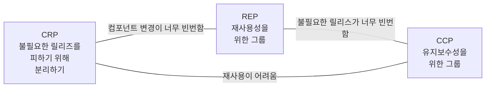
컴포넌트의 각 변은 반대편 꼭지점의 원칙을 포기했을 때의 비용에 대해서 이야기 한다.   

# 컴포넌트 결합
아무리 응집도를 낮춘다 하더라도 코드의 재사용을 위해서는 다른 컴포넌트에 의존할 수 밖에 없다.   
이 챕터에서는 올바르게 컴포넌트를 결합하는 방법에 대하여 배운다.

## 컴포넌트 결합에 대한 세가지 원칙
컴포넌트를 결합하기 위한 세가지 원칙에 대하여 알아보자.   

### ADP: 의존성 비순환 원칙
```
컴포넌트 의존성 그래프에 순환이 있어서는 안 된다.
```
사실 소규모 프로젝트에서는 거의 없는 일이고 깔끔한 아키택트로 설계된 대규모 프로젝트에서는 더더욱 보기 힘든 문제인 '다음날 아침 증후군'(번역본에서는 '숙취 증후군'으로 변역되었다. 왜?)을 방지하기 위한 원칙이다.   
'다음날 아침 증후군'이 정식 용어는 아니고 클린 아키텍처의 저자가 사용한 표현인데 간단히 말하자면 '내가 개발한 코드가 의존하고 있던 다른 컴포넌트의 변경으로 인해 동작하지 않게 되는 현상'을 뜻한다.   
아래 예시와 함께 어째서 의존성 순환이 '다음날 아침 증후군'유발하는지 보자
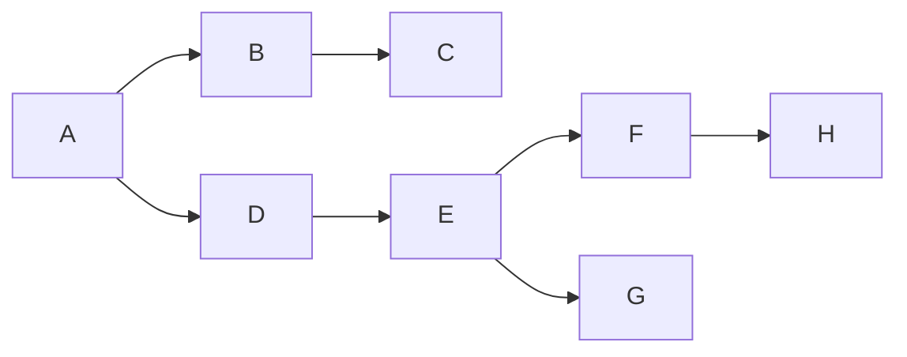
자 단순히 이 평화로운 관계에서는 D의 변경에 대해서 A만이 영향을 받는다. 즉 D를 수정했다면 A와 D만을 확인하면 된다. 그럼 다음을 보자
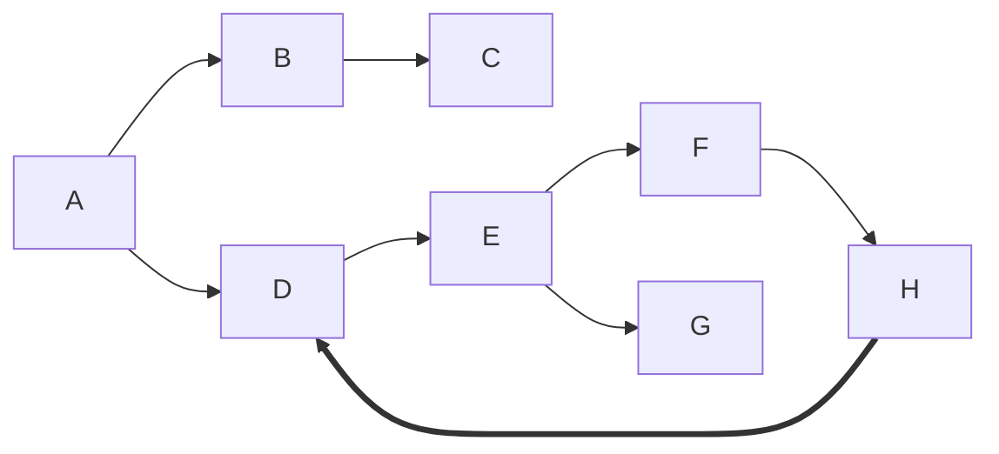
무엇이 문제인지 짐작이 되지 않는가? 그렇다 이제는 D를 변경하면 순환 참조가 이루어 지는 하나의 서클인 D,E,F,H를 모두 확인 해야 한다. 반약 C가 저 순환 의존중인 컴포넌트중 한 컴포넌트를 의존하고 있었다면?   
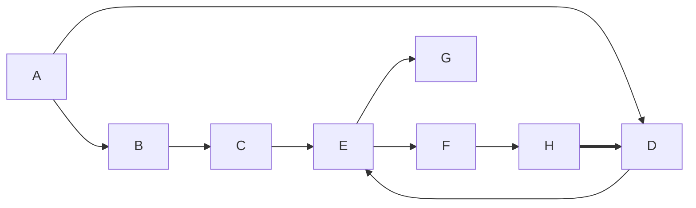
축하한다 단위테스트를 위해 G를 제외한 모든 컴포넌트를 테스트 해야 한다.   
그리고 당연히 이러한 사실을 모르는 D컴포넌트의 개발자가 배포한 릴리즈는 엄청난 '다음날 아침 증후군'을 일으킨다.

이를 해결하기 위해서는 2가지 방법이 있는데 첫번째는 SOLID패턴에서 `추이 종속성`을 제거하기 위해 사용했던 것 처럼 H가 필요한 D의 클래스를 추상화한 인터페이스 만들어 H에 포함시키는 것이다.   
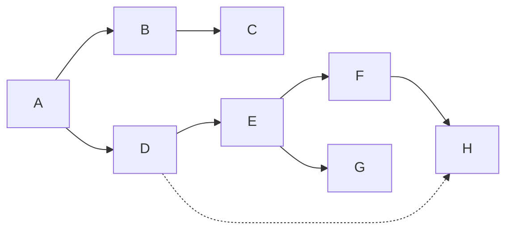

두번째는 두 컴포넌트가 모두 의존하는 새로운 컴포넌트를 만드는 것이다.
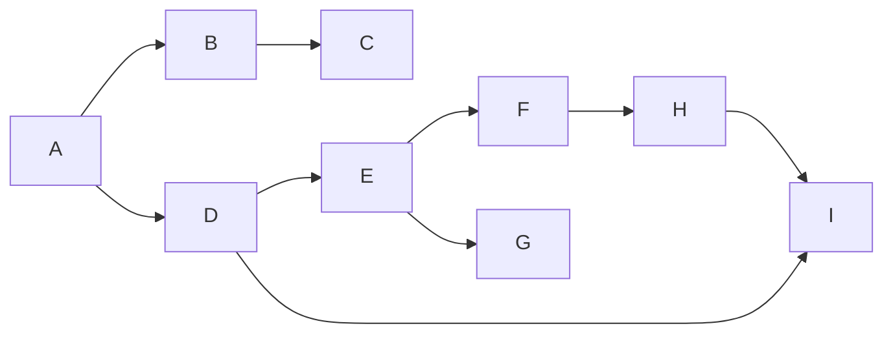

### SPD: 안정된 의존성 원칙
```
안정성의 방향으로 의존하라
```
프로젝트의 요구사항이 변경되면 프로젝트의 설계도 같이 바뀐다.   
그러면서 변경이 쉽게 설계된 컴포넌트에 의존하는 컴포넌트가 생기고 어느새 변경하기 위해서는 큰 모험이 필요하게 되는 경우도 있다. (위 예시에서 D가 순환 참조되며 그런 위치가 되었다.)   
그렇다면 이런 문제를 해결하기 위해 어떻게 해야 할지 알아보자.   
먼저 문제를 해결하기 위해서 문제를 정확하게 이해 하기 위해 '안정성'이 뭔지 알아야 한다.   
안정성의 사전적 정의는 '바뀌어 달라지지 않고 일정한 상태를 유지하는 성질'로 다이아몬드가 영원한 사랑을 약속하듯 한 컴포넌트가 의존하는 다른 컴포넌트는 변경되지 않을 것이라는, 즉 '안정적'일 것이라는 일방적인 약속하에 이루어 진다. 아래 그럼을 보자
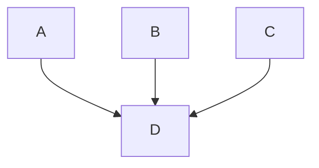
위 그림에서 D는 매우 '안정적'이다. D가 그것을 원했던 원하지 않았던 매우 안정적이어야 한다. A,B,C 세개의 컴포넌트를 책임지고 있기 때문인데 반대로 D는 아무런 컴포넌트도 의존하고 있지 않기 때문에 외적 요인으로 변경되지 않는데 이러한 상태를 '독립적'이라고 한다. 그럼 '불안정적'인 컴포넌트도 한번 보자
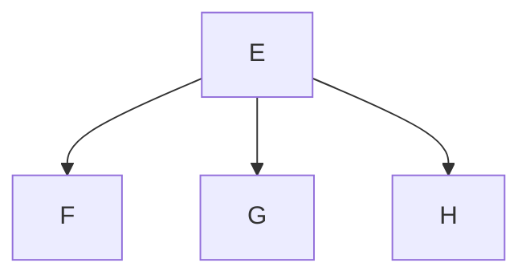
위 그림에서 E는 매우 불안정하다. 의존하고 있는 외부 컴포넌트가 3개가 있기 때문에 변경 가능한 외적 요인이 3개가나 있기 때문이다.   

#### 안정성 지표
책에서는 이러한 '안정성'을 수치화 할 수 있는 공식을 제공 하는데 아래와 같다.
```
FanIn: 해당 컴포넌트가 가지는 책임의 수
FanOut: 해당 컴포넌트가 의존하는 컴포넌트의 수
I: 해당 컴포넌트의 '안정성'

I = FanOut ÷ (FanIn + FanOut)
```
그럼 이러한 지표를 어떻게 활용해야 하는지 아래 예시를 통해 확인 해보자
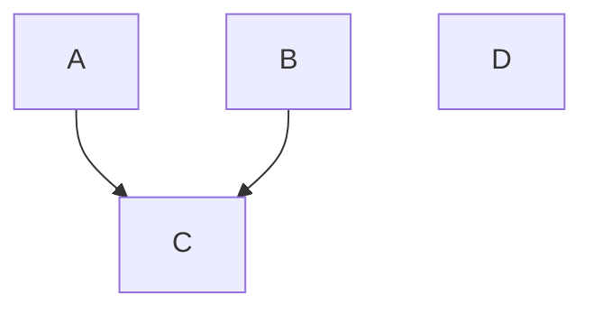
자 위와 같은 관계의 컴포넌트들이 있다. 여기서 D는 변경하기 쉽게 설계되었다. 그런데 C컴포넌트가 D를 참조한다면?
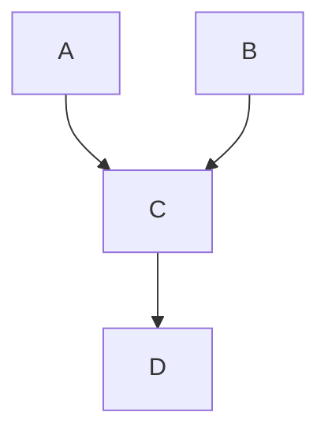
이게 무엇이 문제인지 모르겠나? 그럼 아래 예시를 보라
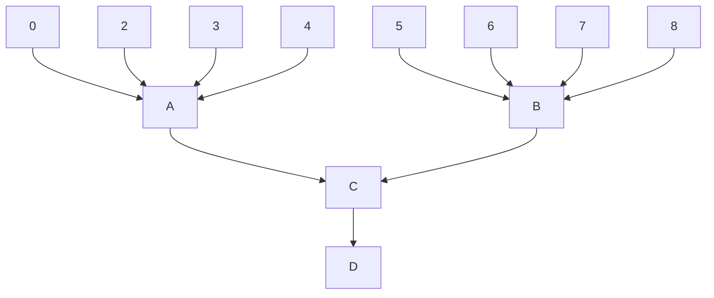
자 이제 D는 '안정적'이어야 한다, 그렇지 않으면 11개의 컴포넌트에 영향을 주게된다.   
이 문제는 C가 C보다 '안정성'(`I`)이 낮은 D를 의존했기 때문에 발생했다.    
그럼 이 문제를 어떻게 해결 할 수 있을까? 감이 좋은 독자라면 벌써 눈치를 챘을 것이다. 그렇다 계속 그래왔듯 DIP(의존관계 역전 원칙)를 적용해서 해결 할 수 있다.

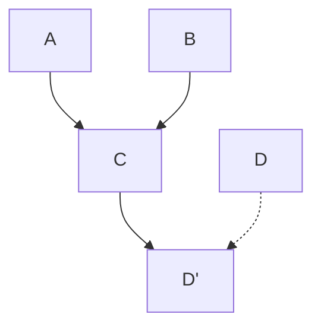
이렇게 된다면 D의 변경은 C에 영향을 주지 않게 된다.   

### SAP: 안정된 추상화 원칙
```
컴포넌트는 안정된 만큼만 추상화 되어야 한다.
```
안정적인 컴포넌트는 추상화 되어 확장이 쉬워야 하며 불안정한 컴포넌트는 구체화 되어 변경이 쉬어야 한다.   
하지만 컴포넌트는 클래스와는 다르게 일부는 추상화되어 있는 부분과 구체화 되어 있는 부분이 뒤섞여 있을 수 있다.   
그래서 각 컴포넌트의 추상화 정도에 대한 지표를 기준으로 생각할 필요가 있다.   
```
Nc: 컴포넌트의 클래스 개수
Na: 컴포넌트의 추상 클래스와 인터페이스의 개수
A: 추상화 정도

A = Na ÷ NC
```
이제 안정성과 추상화의 관계를 정의해 SAP가 추구하는 가치에 대해 알아보자   
아래는 I와 A의 관계를 (I, A)로 나타냈을때 각 꼭지점에 위치한 컴포넌트의 특징이다.
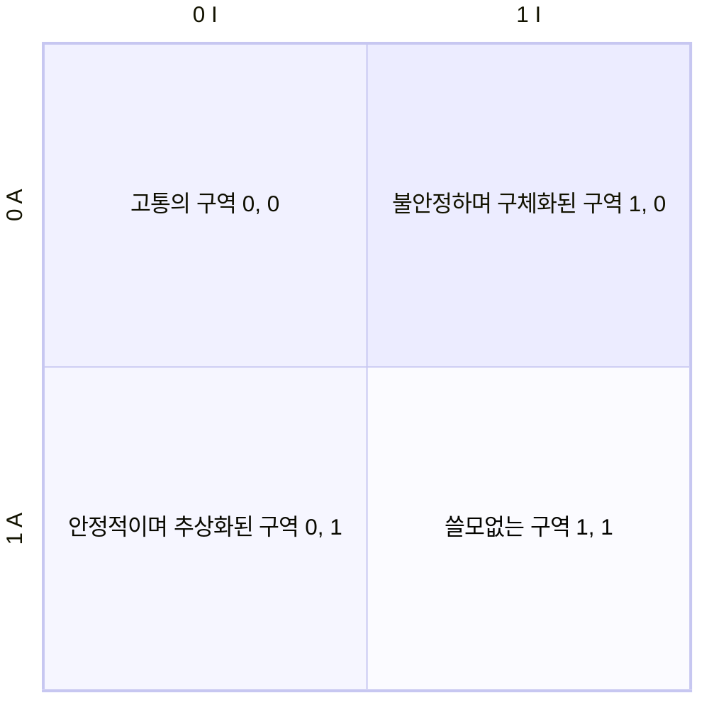
'안정적이며 추상화된'과 '불안정하며 구체화된 구역'에 해당하지 않는 다른 두 구역이 왜 저런 이름인지는 이제 설명할 것이다.   

#### 고통의 구역
```
안정적(수많은 책임을 가지는)이며 구체적인
```
(0, 0)의 구역으로 안정적이라 변경이 필요하지도 않은데 추상하되어 있지 않아 확장도 어렵다. 그렇기 때문에 올바르게 설계된 대부분의 컴포넌트는 여기에 위치하지 않는다.   
다만 '대부분'이 아닌 일부 예외가 있는데 데이터베이스 스키마가 그 중 하나이다.   
데이터베이스 스키마는 계속 변경되는 만큼 매우 구체적인 반면 다른 수많은 컴포넌트가 데이터베이스 스키마에 의존하기 때문에 변경시에 엄청난 고통(다음날 아침 증후군)을 수반한다.   
물론 변경될 경우에만 고통을 수반하기 때문에 변경될 일이 없다면 괜찮다. 대표적인 예시가 유틸리티 라이브러리. 많은 컴포넌트가 의존하지만 변경될 일이 없기에 고통을 수반하지도 않는다.


#### 쓸모없는 구역
```
불안정(책임이 없는)하며 추상적인
```
(1, 1)의 구역으로 추상화된 인터페이스를 구현한 클래스가 없다는 이야기다. 그 말은 그 어떤 시점에서도 해당 컴포넌트를 사용하지 않는다는 뜻이다. 한마디로 쓸대가 없다.   

#### 배제 구역에서 벗어나기
너무 구체적이지도 너무 안정적이지도 않은 상태. 즉 (0, 0)과 (1, 1)사이 중간 어딘가의 (0, 1)과 (1,0)을 잇는 선과 가깝도록 위치하도록 해야 한다.   
이 거리 또한 수치로 계산할 수 있는데 이는 다음과 같다.
```
A: 컴포넌트의 추상화 정도
I: 컴포넌트의 안정성
D: 선분 (0, 1)(1, 0)과 컴포넌트간의 거리

D = |A + I - 1|
```
해당 지표를 토대로 문제가 있는 컴포넌트를 확인하고 면밀히 관찰 할 수 있다. 또한 하나의 컴포넌트에 대해서 시간순으로 기록하여 컴포넌트의 이상을 확인 할 수 있습니다.

