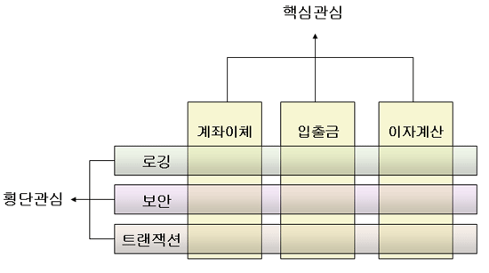

# 프로그래밍 패러다임
프로그램을 어떠한 관점에서, 어떻게 작성해야 하는지에 관한 관점이다. 여러 종류가 있고 아래 등장한 것들 외에도 여러 패러다임이 있을 수 있다. 다만 아래 기술된 패러다임 이외의 패러다임은 사실상 없다고 봐도 무방하다. (일부 패러다임은 패턴으로 사용되기도 한다.)

## 절차적 프로그래밍(프로시저지향 프로그래밍)
놀랍게도 '함수'는 처음부터 있던 개념이 아니라 이때 처음 생겼다. 일렬의 작업을 하나의 과정(프로시저)로서 보고 이를 구조화 하여 사용하는 것이 '프로시저지향 프로그래밍'이다.

## 구조적 프로그래밍
구조적 프로그래밍은 현대의 프로그래머들에게는 아주 당연한 개념이다. 그런걸 모른다고 생각 할 수 있지만. 위에서 아래로, 순서대로 실행된다는 것이 구조적(절차적)프로그래밍 이다.   
그럼 대체 구조적(절차적)이지 않은 프로그래밍은 뭔지 궁금 할 텐데 아래에 예시를 작성 했다. - 대부분의 코드는 js로 진행 하고 싶지만 js에는 goto가 없기 때문에 c를 사용했다.
```c
int main() {
	printf("Hello1") //=> Hello1
	goto jump // jump: 로 이동
	printf("Hello2") //실행 되지 않음
	printf("Hello3") //실행 되지 않음
jump:
	printf("Hello4") //=> Hello4

	return 0;
}
```

<small>*위 코드는 Hello1과 Hello4만을 출력한다.</small>
아마 `goto`라는 구문을 방금 처음 봤을 텐데 `goto`문은 코드의 실행 line을 이동시키는 역할을 한다. 위의 예시를 보면 `goto jump`를 만나 `jump:`로 이동되어 `printf("Hello2")`와 `printf("Hello3")`는 실행되지 않은 모습을 볼 수 있다.   
뭔가 유용해 보일 수 있는데, 이게 엄청나게 위험하다. 남용(하나의 로직에 2번 이상 들어 갔다면 남용의 징조다.)할 경우 '스파게티'를 넘어서 스파게티 중간 중간에 웜홀을 통해 이상한 곳으로 이어 놓은 듯한, '범우주적 다차원 스파게티'가 만들어 지기 때문에 거의 사용하지 않는다. (중첩 반복문과 같은 상황에서만 조금 사용하며 아예 goto문이 없는 언어도 많다.)

## 명령형 프로그래밍
명령형 프로그래밍은 `프로그램의 상태와 상태를 변경시키는 구문의 관점에서 연산을 설명하는 프로그래밍 패러다임의 일종이다.`라고 위키피디아에 적혀 있는데 '상태'를 '변수'로 생각 하면 편하다.   
그럼 반대로 '변수'의 상태를 변경시키지 않고 개발하는 프로그램도 있나? 싶지만 뒤에 오는 '구문의 관점'이라는 단어가 핵심으로 `(프로그램의 상태와 상태를 변경시키는 구문)의 관점에서 연산을 설명`하는 패러다임이다. 당연히 무슨 소리인지 모르겠으니 이제 이게 뭔소린지 알아보자.
```js
let sum = 0;
for(let i = 1; i <= 10;i++) {
	sum += i;
}
console.log(sum);
```
<small>*위 코드는 1에서 10까지 출력하는 프로그램이다.</small>
위의 코드는 아주 흔한 1~10까지의 정수를 모두 더한 후 출력하는 프로그램이다. 이제 부터 이걸 명령형으로 변환시킨다고 생각 할 수도 있는데 그냥 이게 '명령형 프로그래밍'이다.   
자 이게 무슨 소리인지 혼란스럽겠지만 설명 주석을 추가한 코드를 보자.

```js
let sum = 0; // 정수형 변수 sum을 선언하며 0으로 초기화
for(let i = 1; i <= 10;i++) { // 정수형 변수 i를 선언하며 1로 초기화 하고 i가 10보다 작거나 같을 동안 i를 1증가시키며 block을 반복한다. block을 시작한다.
	sum += i; //sum과 i를 더한 값을 sum에 할당한다.
} // block을 종료한다.
console.log(sum); // sum을 출력한다.
```
이쯤 되면 뭐가 '명령형'인지 대강 이해가 가기 시작 했을 것이다. 그렇다. 그냥 여러분이 작성한 코드는 죄다 '명령형 프로그래밍'이다.   

## 객체 지향 프로그래밍
`객체 지향`은 구현할 프로그램의 여러 요소를 각각 하나의 객체로 보고 프로그램은 이러한 객체 들의 상호작용으로 이루어 지는 방식을 뜻한다.   

### 클래스 기반 프로그래밍
`객체 지향`을 구현하는 방식중 하나로 객체의 형태를 나타내는 '클래스'를 정의하고 해당 클래스로 '인스턴스'를 생성한다. java를 통한 예시를 보자
```java
class Cat {
	public int age;
	...
}
...

Cat cat = new Cat();
cat.age = 11;
```
class인 Cat을 정의할때는 실제 객체는 없고 객체가 어떤 형태를 가지고 있는지, 객체의 형태를 정의 했을 뿐이다. 실제로 객체를 생성한 것은 `new Cat()`이다.

### 프로토타입 기반 프로그래밍
설명하기 어렵다.   
클래스로 형태를 정의하고 인스턴스로 객체를 생성하는 클래스 기반과는 다르게 프로토타입 기반은 객체를 복사하여 작동한다. 적절한 예시는 아니지만 아래 예시를 보자
```js
function Cat() {
	this.age = undefined;
}

let cat = new Cat();
cat.age = 11;
```
그냥 class를 통해 만드는 것과 뭐가 다른지 모를 것이다.   
하지만 자세히 보면 다른데 기본적으로 `function Cat()`을 선언한 시점에서 객체가 만들어졌다. (물론 js를 모르는 독자에게 이것을 설명할 방법은 없다.)   
Object라고 하는 `원시 프로토타입`을 복사하여 확장(`this.age = undefined`)한 Cat이라는 새로운 프로토타입이 만들어진다. 그리고 new를 통해 해당 프로토타입 객체, Cat을 복사한 새로운 객체 cat을 만든다.


### 관점 지향 프로그래밍
프로그램의 각 로직을 관심사로 나누어 모듈링하는 방식으로 여러곳에서 공통적으로 사용되는 기능을 '핵심 관심사'로 분리하여 코드의 재사용성을 높이는 방식이다.


## 선언형 프로그래밍
선언형 프로그래밍은 위의 '명령형 프로그래밍'과 반대되는 개념이라는 이야기가 있는데 참/거짓 처럼 완전 상반되는 것이 아니고 그냥 분류가 2개 밖에 없어서 그렇다.   
실제로 두 방식은 반대되는게 아니라 그냥 다른 방식이다. 에초에 '선언형 프로그래밍 언어'에는 'SQL'같은 언어도 포함되어 있다.   
선언형을 이해하는 방식은 '어떻게 아니라 뭘'이다. 다음 SQL을 보자
```sql
SELECT
	user_name
FROM
	tb_user
WHERE
	user_name NOT NULL
```
<small>*위 코드는 tb_user테이블에서 user_name이 null이 아닌 row에서 user_name을 조회하는 쿼리다.</small>
자 눈치가 빠른 독자라면 무슨 이야기를 할지 대충 예상이 갈 것이다. 물론 그렇지 않은 여러분을 위해 설명 주석을 추가한 코드를 보자.

```sql
SELECT -- 가져온다.
	user_name -- user_name을
FROM -- 에서
	tb_user -- tb_user 테이블
WHERE -- 단
	user_name NOT NULL -- user_name이 NULL이 아닌
```
위의 '명령형 프로그래밍'의 설명과 비교하면 알겠지만, 명령하는 부분이 없다. '뭘 어떻게 해야 한다'가 아니라 '뭐를 한다'를 명시한다.   
과정을 명시하는 것이 아닌 뭘 하는지를 선언하는 것. 그것이 '선언형 프로그래밍'이다. 

## 논리형 프로그래밍
논리형 언어는 기호 논리 형태의 규칙과 사실을 정의하는 방식으로 동작한다.   
조금더 직관적으로 수학적 증명과 같은 방식으로 문제를 해결한다.   
명령형 프로그래밍처럼 연속된 '연산'을 통해서 문제를 해결하는 것이 아닌 미리 정의한 '규칙'과 '사실'을 통해 해당 문제를 증명하는 방식으로 동작한다. 어떻게 해답을 찾는다는지 이상하다고 생각 할 수 있지만 수학문제를 푸는 것과 같다. 예를 들어 다음 문제를 보자
```
1 + 1 = ?
```
무슨 이야기를 하는지 짐작이 가는가? 명령형 프로그래밍에서는 1 + 1에 대한 연산을 진행해서 결과를 만들지만 논리형 프로그래밍에서는 덧셈의 정의에 따라 1의 1번째 다음인 2로 정의된다.   

## 이벤트 기반 프로그래밍 (Event-driven)
이벤트의 발생에 의해 프로그램의 흐름이 결정되는 방식으로 사용자와 UI의 상호작용에 의해서 프로그램이 동작한다. 아래는 js를 통한 예제이다.
```js
document.querySelector('button').addEventListener('click', function(e) {
	alert('button click!');
})
```
# 인공지능 패러다임
자세히 다루지는 않는데 위키백과의 패러다임 목록에 있어 적어두긴 한다.

## 규칙기반 프로그래밍
이번에 조사를 하며 처음 알게 된 개념인데 정의는 '소프트웨어 시스템의 실행 흐름/동작이 사람이 읽을 수 있는 '규칙'집합에 의해 명시적으로 결정되는 프로그래밍 패러다임.'이라고 하는데 인공지능 용어다. 기존의 AI의 동작 방식으로 미리 정의된 '규칙'들에 현재 상태를 대입하여 결과를 반환한다.

## 머신러닝 프로그래밍
fx(A) = B의 규칙을 가지는 데이터 A와 B를 한세트로 데이터들의 규칙 fx를 찾아 데이터들에는 없던 다른 데이터 A'에 따른 B'을 찾는 방식으로 기존 `규칙기반 프로그래밍`은 fx를 프로그래머가 정의하는 반면 `머신러닝 프로그래밍`에서는 fx를 프로그램이 정의 한다는 것이 가장 큰 차이점이다.   
